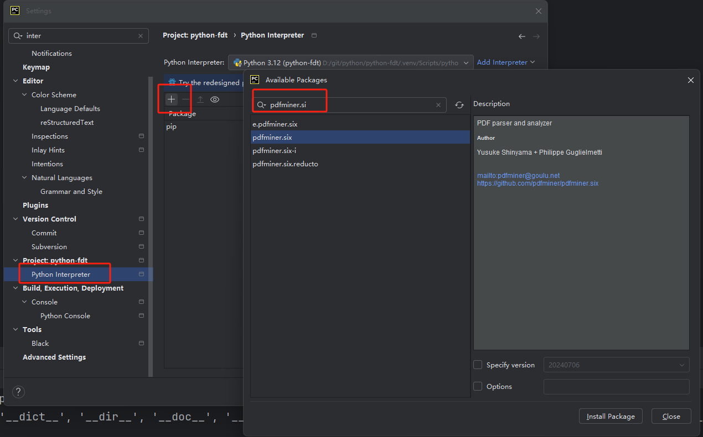

- [语法基础](#%E8%AF%AD%E6%B3%95%E5%9F%BA%E7%A1%80)
  * [Code01.py](#code01py)
    + [注释](#%E6%B3%A8%E9%87%8A)
    + [输出](#%E8%BE%93%E5%87%BA)
    + [变量](#%E5%8F%98%E9%87%8F)
    + [数值类型](#%E6%95%B0%E5%80%BC%E7%B1%BB%E5%9E%8B)
    + [字符串](#%E5%AD%97%E7%AC%A6%E4%B8%B2)
    + [格式化输出](#%E6%A0%BC%E5%BC%8F%E5%8C%96%E8%BE%93%E5%87%BA)
  * [Code02.py](#code02py)
    + [转义字符](#%E8%BD%AC%E4%B9%89%E5%AD%97%E7%AC%A6)
    + [运算符](#%E8%BF%90%E7%AE%97%E7%AC%A6)
    + [类型转换](#%E7%B1%BB%E5%9E%8B%E8%BD%AC%E6%8D%A2)
    + [输入](#%E8%BE%93%E5%85%A5)
    + [if语句](#if%E8%AF%AD%E5%8F%A5)
    + [逻辑运算符](#%E9%80%BB%E8%BE%91%E8%BF%90%E7%AE%97%E7%AC%A6)
    + [random类](#random%E7%B1%BB)
    + [while循环](#while%E5%BE%AA%E7%8E%AF)
    + [range函数](#range%E5%87%BD%E6%95%B0)
    + [for循环](#for%E5%BE%AA%E7%8E%AF)
  * [Code03_Str.py](#code03_strpy)
    + [字符串](#%E5%AD%97%E7%AC%A6%E4%B8%B2-1)
      - [字符编码](#%E5%AD%97%E7%AC%A6%E7%BC%96%E7%A0%81)
      - [几种字符编码](#%E5%87%A0%E7%A7%8D%E5%AD%97%E7%AC%A6%E7%BC%96%E7%A0%81)
      - [encode编码](#encode%E7%BC%96%E7%A0%81)
      - [decode解码](#decode%E8%A7%A3%E7%A0%81)
      - [索引](#%E7%B4%A2%E5%BC%95)
      - [切片](#%E5%88%87%E7%89%87)
      - [字符串的常用操作](#%E5%AD%97%E7%AC%A6%E4%B8%B2%E7%9A%84%E5%B8%B8%E7%94%A8%E6%93%8D%E4%BD%9C)
  * [Code04_List.py](#code04_listpy)
    + [列表](#%E5%88%97%E8%A1%A8)
      - [列表基本性质](#%E5%88%97%E8%A1%A8%E5%9F%BA%E6%9C%AC%E6%80%A7%E8%B4%A8)
      - [列表的遍历](#%E5%88%97%E8%A1%A8%E7%9A%84%E9%81%8D%E5%8E%86)
      - [列表添加元素](#%E5%88%97%E8%A1%A8%E6%B7%BB%E5%8A%A0%E5%85%83%E7%B4%A0)
      - [列表修改元素](#%E5%88%97%E8%A1%A8%E4%BF%AE%E6%94%B9%E5%85%83%E7%B4%A0)
      - [列表删除元素](#%E5%88%97%E8%A1%A8%E5%88%A0%E9%99%A4%E5%85%83%E7%B4%A0)
      - [列表查找元素](#%E5%88%97%E8%A1%A8%E6%9F%A5%E6%89%BE%E5%85%83%E7%B4%A0)
      - [列表排序](#%E5%88%97%E8%A1%A8%E6%8E%92%E5%BA%8F)
      - [列表推导式](#%E5%88%97%E8%A1%A8%E6%8E%A8%E5%AF%BC%E5%BC%8F)
  * [Code05_Tuple.py](#code05_tuplepy)
    + [元组](#%E5%85%83%E7%BB%84)
      - [元组的定义](#%E5%85%83%E7%BB%84%E7%9A%84%E5%AE%9A%E4%B9%89)
      - [元组的操作](#%E5%85%83%E7%BB%84%E7%9A%84%E6%93%8D%E4%BD%9C)
  * [Code06_Dictionary.py](#code06_dictionarypy)
    + [字典](#%E5%AD%97%E5%85%B8)
      - [字典增删改查](#%E5%AD%97%E5%85%B8%E5%A2%9E%E5%88%A0%E6%94%B9%E6%9F%A5)
      - [字典常用操作](#%E5%AD%97%E5%85%B8%E5%B8%B8%E7%94%A8%E6%93%8D%E4%BD%9C)
  * [Code07_Set.py](#code07_setpy)
    + [集合](#%E9%9B%86%E5%90%88)
      - [集合的定义](#%E9%9B%86%E5%90%88%E7%9A%84%E5%AE%9A%E4%B9%89)
      - [集合添加元素](#%E9%9B%86%E5%90%88%E6%B7%BB%E5%8A%A0%E5%85%83%E7%B4%A0)
      - [集合删除元素](#%E9%9B%86%E5%90%88%E5%88%A0%E9%99%A4%E5%85%83%E7%B4%A0)
      - [交集、并集](#%E4%BA%A4%E9%9B%86%E5%B9%B6%E9%9B%86)
  * [阶段总结](#%E9%98%B6%E6%AE%B5%E6%80%BB%E7%BB%93)
    + [运算符](#%E8%BF%90%E7%AE%97%E7%AC%A6-1)
    + [公共方法](#%E5%85%AC%E5%85%B1%E6%96%B9%E6%B3%95)
  * [Code08.py](#code08py)
    + [类型转换](#%E7%B1%BB%E5%9E%8B%E8%BD%AC%E6%8D%A2-1)
    + [深浅拷贝](#%E6%B7%B1%E6%B5%85%E6%8B%B7%E8%B4%9D)
    + [不可变对象](#%E4%B8%8D%E5%8F%AF%E5%8F%98%E5%AF%B9%E8%B1%A1)
    + [可变对象](#%E5%8F%AF%E5%8F%98%E5%AF%B9%E8%B1%A1)
  * [Code09_Function.py](#code09_functionpy)
    + [函数](#%E5%87%BD%E6%95%B0)
      - [函数的定义](#%E5%87%BD%E6%95%B0%E7%9A%84%E5%AE%9A%E4%B9%89)
      - [函数的参数](#%E5%87%BD%E6%95%B0%E7%9A%84%E5%8F%82%E6%95%B0)
      - [作用域](#%E4%BD%9C%E7%94%A8%E5%9F%9F)
      - [全局变量和局部变量](#%E5%85%A8%E5%B1%80%E5%8F%98%E9%87%8F%E5%92%8C%E5%B1%80%E9%83%A8%E5%8F%98%E9%87%8F)
      - [匿名函数](#%E5%8C%BF%E5%90%8D%E5%87%BD%E6%95%B0)
      - [内置函数](#%E5%86%85%E7%BD%AE%E5%87%BD%E6%95%B0)
      - [拆包](#%E6%8B%86%E5%8C%85)
      - [异常捕获](#%E5%BC%82%E5%B8%B8%E6%8D%95%E8%8E%B7)
      - [抛出异常](#%E6%8A%9B%E5%87%BA%E5%BC%82%E5%B8%B8)
  * [Code10_Module.py](#code10_modulepy)
    + [模块](#%E6%A8%A1%E5%9D%97)
      - [内置模块](#%E5%86%85%E7%BD%AE%E6%A8%A1%E5%9D%97)
      - [第三方库](#%E7%AC%AC%E4%B8%89%E6%96%B9%E5%BA%93)
      - [自定义模块](#%E8%87%AA%E5%AE%9A%E4%B9%89%E6%A8%A1%E5%9D%97)
      - [__name__和__main__](#__name__%E5%92%8C__main__)
    + [包](#%E5%8C%85)
  * [Code11.py](#code11py)
    + [递归函数](#%E9%80%92%E5%BD%92%E5%87%BD%E6%95%B0)
    + [函数的引用](#%E5%87%BD%E6%95%B0%E7%9A%84%E5%BC%95%E7%94%A8)
    + [闭包](#%E9%97%AD%E5%8C%85)
    + [装饰器](#%E8%A3%85%E9%A5%B0%E5%99%A8)
    + [回调函数](#%E5%9B%9E%E8%B0%83%E5%87%BD%E6%95%B0)

# 语法基础
## [Code01.py](Code01.py)
### 注释
```python
# 单行注释

'''
多行注释（不推荐）
'''

"""
另一种多行注释（推荐）
"""
```
### 输出
```python
# 打印多个字符
print('hello world', '你好')
# 默认\n为结尾，可以修改
print('可以修改end', end=',')
```
### 变量
1. 标识符的规范：见名知其意  
2. 标识符命名规范    
2.1 只能由数字、字母、下划线组成   
2.2 不能以数字开头   
2.3 不能是关键字   
2.4 区分大小写   
3. 变量名的命名规范   
3.1 驼峰命名：userName   
3.2 下划线  
### 数值类型
1. 整型：int
2. 浮点型：float
3. 布尔型：bool  
### 字符串
1. 字符串连接：+  
2. 重复输出字符串：*   
3. in、not in操作符
4. r转译字符
### 格式化输出
按照我们想要输出的格式，先定义一个模板，照着模板输出  
1. 注意%f保留小数位的写法  
```python
age = 18
name = "Wil"
# 保留1位小数就是%.1f，其他同理
height = 170.3
print("我的名字是%s，我的年龄是%d，我的身高是%.1fcm" % (name, age, height))
```   
2. format()   
2.1 不带数字编号{}  
```python
age = 18
name = "Wil"
print("My name is {}, my age is {}".format(name, age))
```  
   2.2 带数字编号{0} {1} 
```python
age = 18
name = "Wil"
print("My name is {0}, my age is {1}, my brother's name is {0} too".format(name, age))
```  
   2.3 设置参数  
```python
print("用户名{userName} 密码是{pwd}".format(userName="root", pwd="123"))
```  
3. f{'表达式'}
```python
age = 18
name = "Wil"
print(f'My name is {name}, my age is {age}')
```

## [Code02.py](Code02.py)
### 转义字符
### 运算符
1. // 取整除，返回除法的整数部分（商）。例如9//2=4  
2. ** 幂，又称次方、乘方。例如2**3=8  
3. += 例如a+=b等价于 a = a+b  
4. -= 例如a-=b等价于 a = a-b  
5. /=、*=、//=、**=、%= 同理
### 类型转换
1. 数值转str：str(num)
2. str转整数：int(str)，其他同理
### 输入
input函数
### if语句
```python
score = 50
if score>=80:
    print("优秀")
elif 60 <= score < 80:
    print("及格")
else:
    print("不及格")
```
### 逻辑运算符
and or not
### random类
1. random.random()：随机生成一个[0,1)之间的浮点数。
2. random.randint(a,b)：随机生成[a,b]范围内一个整数。
3. random.randrange(a,b,step)  
3.1 不指定step，随机生成[a,b)范围内一个整数。  
3.2 指定step，step作为步长会进一步限制[a,b)的范围，比如randrange(0,11,2)意即生成[0,11)范围内的随机偶数。  
3.3 不指定a，则默认从0开始。  
4. random.uniform(a,b)：产生[a,b]范围内一个随机浮点数。  
5. random.choice(seq)：从非空序列中随机选取一个数据并带回，该序列可以是list、tuple、str、set。  
```python
import random
# 随机输出”石头“、”剪刀“、”布“
myList = ["石头","剪刀", "布"]
print(random.choice(myList))
```    
### while循环
```python
i = 0
while i < 10:
    print(f"i= {i}")
    if i % 2 == 0:
        print(f"这是偶数：{i}")
    i += 1
```
### range函数
range(a, b, step)  
1. 表示[a, b)范围的整数  
2. a不填默认为0  
3. step: 每次跳跃的间距，不填默认为1  
```python
for i in range(5):
    print(i)
# 0 1 2 3 4
```
### for循环
```python
# 求1——100累加和
sum = 0
for i in range(1, 101):
    sum += i
print(sum)
```  
1. break关键字：和Java同理
2. continue关键字：和Java同理  

## [Code03_Str.py](Code03_Str.py)
### 字符串
#### 字符编码
字符编码的本质是二进制数据与语言文字的一一对应关系  
#### 几种字符编码
1. unicode：兼容万国语言
2. utf-8：unicode的实现方式之一，优势是对不同的字符用不同的长度来表示
3. gbk：专门解决中文编码，每个字符占2字节
4. utf-8中一个英文/数字占用一个字节，一个汉字占3~4个字节
#### encode编码
通过encode编码可以将字符转换为二进制字节流   
```python
str1 = "hello world"
stream = str1.encode("utf-8") # 默认utf-8
print(type(stream)) # <class 'bytes'>
```  
直接将字符串用二进制流表示
```python
s1 = b"hello"
print(type(s1)) # <class 'bytes'>
```
#### decode解码
通过decode将二进制字节流转换为字符串
````python
# decode解码
s2 = b"hha"
print(s2.decode("utf-8"))
````
#### 索引
字符串中的索引即下标，从0开始
```python
s3 = "abcd"
print(s3[0]) # a
print(s3[3]) # d
```  
在python中不仅支持顺序索引，同时还支持倒序索引，倒序从-1开始
```python
s3 = "abcd"
print(s3[-1]) # d
print(s3[-2]) # c
```
#### 切片
字符串切片语法：[起始索引:结束索引:步长]，范围左闭右开，步长默认为1  
````python
name = "class_name_peter"
print(name[6:10:1]) # name
print(name[6:10:2]) # nm
print(name[:]) # class_name_peter
print(name[-1:3:-1]) # retep_eman_s
````
1. 切片区间为左闭右开
2. 步长可以控制查找方向，步长为正时表示从左向右定位，步长为负数表示从右往左定位
3. 切片时索引超出范围不会报错，查找范围截止至最后一位
4. 索引取值方向和步长方向要保持一致，否则不会取到值
#### 字符串的常用操作
1. find(子串, startIndex, endIndex)  
子串是否在字符串中，如果在返回第一次找到时的索引值，否则返回-1   
可以通过startIndex、endIndex指定查找范围
```python
mytest = "this is my test"
print(mytest.find("this")) # 0
print(mytest.find("hello")) #-1
```
2. index(子串, startIndex, endIndex)     
跟find非常相似，不同点是，当查找不存在时，该方法会报错
```python
mytest = "this is my test"
print(mytest.index("this")) # 0
print(mytest.index("hello")) # ValueError: substring not found
```
3. count(子串, startIndex, endIndex)       
查找子串出现在字符串中的次数  
```python
mytest = "this is my test"
print(mytest.count("t")) #3
print(mytest.count("hello")) #0
```
4. replace(旧字串, 新字串, 替换次数)
````python
test1 = "this is test1"
print(test1.replace("t", "T")) # This is TesT1
print(test1.replace("t", "T", 1)) # This is test1
````
5. split(子串, 切的次数)
````python
test2 = "what a fuck this world"
print(test2.split(" ")) # ['what', 'a', 'fuck', 'this', 'world']
print(test2.split(" ", 1))  # ['what', 'a fuck this world']
````
6. capitalize()   
只将首字母大写  
```python
test1 = "this is test1"
print(test1.capitalize())  # This is test1
```
7. lower()  
将所有大写变为小写   
```python
test3 = "HELLO WORLD"
print(test3.lower())  # hello world
```  
8. upper()  
将所有小写变为大写  
```python
test4 = "how are you"
print(test4.upper())  # HOW ARE YOU
```
9. title()  
将每个单词首字母变大写  
````python
test4 = "how are you"
print(test4.title())  # How Are You
````
10. islower()  
````python
test4 = "how are you"
print(test4.islower())  # True
test5 = "How are you"
print(test5.islower())  # False
````
11. isupper()

````python
test3 = "HELLO WORLD"
test5 = "How are you"
print(test3.isupper())  # True
print(test5.isupper())  # False
````
12. isdigit()  
判断字符串是否是数字
```python
numStr = "124"
print(numStr.isdigit())  # True
strNum = "3.1E5"
print(strNum.isdigit())  # False
```
13. startswith(子串)  
````python
test5 = "How are you"
print(test5.startswith("how"))  # False
print(test5.startswith("How"))  # True
````
14. endswith(子串)
````python
test5 = "How are you"
print(test5.endswith("you"))  # True
````
15. join
```python
code = "python"
print("*".join(code))  # p*y*t*h*o*n
```
16. strip()  
只能删除字符串<font color=red>首尾</font>的空格
17. lstrip()  
删除字符串开头的空格
18. rstrip()  
删除字符串末尾的空格 

## [Code04_List.py](Code04_List.py)
### 列表
#### 列表基本性质
1. 列表的定义：中括号包围所有元素，每个元素间用逗号分割
2. 列表的性质：有序、存储多个元素，元素可以是不同类型
3. 列表的下标从左往右是从0开始，也可以倒着来，即从右往左从-1开始
4. 索引超出列表长度会报错
```python
li = ["a", "b", 121, "hello"]
print(li[1])  # b
print(li[-2])  # 121
print(li[10])  # IndexError: list index out of range
```
#### 列表的遍历
1. for循环遍历
````python
li = ["a", "b", 121, "hello"]
for i in li:
    print(i)
````
2. while循环遍历
````python
li = ["a", "b", 121, "hello"]
i = 0
while i < len(li):
    print(li[i])
    i += 1
````
#### 列表添加元素
1. 直接相加：+
````python
language = ["Python", "Java", "C++"]
numList = [1990, 1222, 5554]
language = language + numList
print(language)  # ['Python', 'Java', 'C++', 1990, 1222, 5554]
````
2. insert(index, obj): 在index前面插入obj元素    
2.1 当index是正数时，会在index下标处插入元素    
2.2 当index是负数时，会在index前面插入元素  
2.3 当index大于列表长度时，会在首/尾插入元素  
2.4 元组会作为一个整体插入   
````python
language = ["Python", "Java", "C++"]
language.insert(1, "Go")
language.insert(10, "C#")
language.insert(-1, "JS")
language.insert(-10, "html")
print(language)  # ['html', 'Python', 'Go', 'Java', 'C++', 'JS', 'C#']
t = ("Shell", "C")
language.insert(0, t)
print(language)  # [('Shell', 'C'), 'html', 'Python', 'Go', 'Java', 'C++', 'JS', 'C#']
````
3. append(obj): 直接在列表末尾添加元素
4. extend(obj): 也是在末尾添加元素，但是会识别obj中的元素拆分成单个的
````python
li1 = ["aaa", "bbb"]
li2 = ["ddd", "tttt"]
li1.append(li2)
print(li1)  # ['aaa', 'bbb', ['ddd', 'tttt']]
li1.extend(li2)
print(li1)  # ['aaa', 'bbb', ['ddd', 'tttt'], 'ddd', 'tttt']
````
#### 列表修改元素
修改元素的本质就是赋值   
1. 修改单个元素  
````python
breakfast = ["豆浆", "油条"]
breakfast[0] = "豆腐脑"
print(breakfast)  # ['豆腐脑', '油条']
````
2. 修改一组元素：<font color = red>注意左闭右开</font>

````python
breakfast = ["豆浆", "油条", "包子", "馒头"]
breakfast[1:4] = ["鸡蛋"]  # 左闭右开
print(breakfast)  # ['豆浆', '鸡蛋']
````
3. 对空切片赋值操作

````python
breakfast = ["豆浆", "油条", "包子", "馒头"]
breakfast[2:2] = ["鸡蛋"]  # 左闭右开
print(breakfast)  # ['豆浆', '油条', '鸡蛋', '包子', '馒头']
````
#### 列表删除元素
1. del
````python
r = list("hello")
print(r)  # ['h', 'e', 'l', 'l', 'o']
del r[0]
print(r)  # ['e', 'l', 'l', 'o']
del r[0:2]  # 左闭右开
print(r)  # ['l', 'o']
del r
print(r)  # NameError: name 'r' is not defined
````
2. pop(index)：下标删除，如果不填下标则默认删除列表中最后一个元素
````python
nums = [1, 2, 3, 4, 5]
p = nums.pop()
print(p)  # 5
print(nums)  # [1, 2, 3, 4]
````
3. remove(obj)
````python
mm = ["Hello", "world", "you"]
mm.remove("you")
print(mm)  # ['Hello', 'world']
````
4. clear：删除所有元素
````python
mm = ["Hello", "world", "you"]
mm.clear()
print(mm)  # []
````
#### 列表查找元素
1. in/not in
````python
find = ["Hello", "world", "you"]
print("he" in find)  # False
print("you" in find)  # True
print("lla" not in find)  # True
````
2. count(obj)：统计obj元素出现在列表中的次数   
可用此方法来判断某个元素是否在列表中  
3. index(obj, start, end)：查找obj元素在列表中的索引位置，如果元素不存在则报错
````python
find = ["Hello", "world", "you"]
print(find.index("he"))  # ValueError: 'he' is not in list
````
#### 列表排序
1. reverse
````python
kk = [1, 2, 3, 4]
kk.reverse()
print(kk)  # [4, 3, 2, 1]
````
2. sort()  
2.1 只能用于列表排序   
2.2 会直接改变原列表的顺序
````python
hh = [5, 2, 65, 4, 8, 1]
hh.sort()  # 默认从小到大
print(hh)  # [1, 2, 4, 5, 8, 65]
hh.sort(reverse=True)  # 从大到小
print(hh)  # [65, 8, 5, 4, 2, 1]
````
3. sorted()     
3.1 python内置的   
3.2 不会修改原数组的值
````python
ff = [1, 4, 2, 9, 3]
ff1 = sorted(ff)
print(ff)  # [1, 4, 2, 9, 3]
print(ff1)  # [1, 2, 3, 4, 9]
````
#### 列表推导式
````python
# 给列表中的每个元素都乘以2
dd = [1, 2, 3, 4]
print([i * 2 for i in dd])  # [2, 4, 6, 8]
````
## [Code05_Tuple.py](Code05_Tuple.py)
### 元组
元组是不可变的list类型，不可以增删改。   
意义：因为元组不支持增删改，所以提高了代码编写的安全性，如果有只读场景，可以考虑使用元组。    
#### 元组的定义   
定义单个元素的元组时要加逗号
````python
# 元组的定义
tup = (1, 3, 4)
# 定义单个元素的元组时要加逗号
tup1 = (1)
print(type(tup1))  # <class 'int'>
tup1 = (1,)
print(type(tup1))  # <class 'tuple'>
````
#### 元组的操作
1. count
2. index
3. len
```python
tup1 = (1,)
print(len(tup1))  # 1
```
4. 元组”可变“的情况
````python
tt = (3, 5, [99, 88, 77], 6)
tt[2][0] = 66
print(tt)  # (3, 5, [66, 88, 77], 6)
````
## [Code06_Dictionary.py](Code06_Dictionary.py)
### 字典
就是HashMap
````python
# 定义字典
dic1 = {}
dic2 = {"name": "ll", "age": 18}
dic3 = dict()
````
#### 字典增删改查
````python
dic3 = dict()

# 添加元素
dic3["id"] = 1
dic3["name"] = "Lucy"
print(dic3)  # {'id': 1, 'name': 'Lucy'}

# 修改元素
dic3["name"] = "Peter"
print(dic3)  # {'id': 1, 'name': 'Peter'}

# 查找
print(dic3["name"])  # Peter

# 删除元素
del dic3["name"]
print(dic3)  # {'id': 1}

# 清空字典
dic3.clear()
print(dic3)  # {}
````
#### 字典常用操作
1. len
````python
map = {"id": 2}
print(len(map))  # 1
````
2. keys()、values()
````python
map = {"id": 2, "age": 20, "name": "MyName"}
keys = map.keys()
for k in keys:
    print(k)

values = map.values()
for v in values:
    print(v)
````
3. items()   
一对一对的遍历
```python
map = {"id": 2, "age": 20, "name": "MyName"}
items = map.items()
for key, value in items:
    print(key, value)

# 输出如下
# id 2
# age 20
# name MyName
```
## [Code07_Set.py](Code07_Set.py)
### 集合
相当于Java中的Set集合，元素无序且不重复
#### 集合的定义
````python
# 定义集合
s1 = {10, 20, 30}
print(type(s1))  # <class 'set'>
# 字符串转集合
s2 = set("hello")
print(s2)  # {'h', 'l', 'o', 'e'}
# 定义一个空集合
s3 = set()
````
#### 集合添加元素
1. add()
````python
s3 = set()
s3.add("zoo")
s3.add(1)
s3.add(1)  # 自动去重
print(s3)  # {'zoo', 1}
````
2. update(obj)：obj必须是可迭代对象（列表、集合、字典、元组等）   
当update的元素是字典时，只添加key
````python
s4 = set()
s4.update([10, 11])
s4.update((12, 56))
print(s4)  # {56, 10, 11, 12}
s4.update({"name": "Pe"})
print(s4)  # {56, 10, 11, 12, 'name'}
````
#### 集合删除元素
1. remove(obj): 删除指定元素，如果不存在则报错
2. discard(obj): 删除指定元素，如果不存在不会报错
3. pop(): 随机删除一个元素，返回删除的元素
#### 交集、并集
````python
l = {1, 2, 3, 4}
m = {3, 4, 5, 6}
# 求交集
print(l & m)  # {3, 4}
# 求并集
print(l | m)  # {1, 2, 3, 4, 5, 6}
````
## 阶段总结
### 运算符
|运算符|描述|支持的容器类型|
|:----|:----|:----|
|+|合并|字符串、列表、元组|
|*|复制|字符串、列表、元组|
|in|元素是否存在|字符串、列表、元组、字典|
|not in|元素是否不存在|字符串、列表、元组、字典|
### 公共方法
|公共方法|描述|支持的容器类型|
|:----|:----|:----|
|len|求长度，即元素个数|字符串、列表、元组、字典、集合|
|max|求最大元素|列表、元组、集合|
|min|求最小值|列表、元组、集合|
|enumerate|将下标和数据一一列出来|列表、元组|

## [Code08.py](Code08.py)
### 类型转换
1. 转字符串：str(o)
2. 转列表：list(o)
3. 转元组：tuple(o)
4. 转集合：set(o)
5. 转字典：dict(o)
```python
int = 5
# 整数转为字符串
s = str(5)
# 字符串转为list
l = list(s)
# 字符串转为元组
tu = tuple(s)
# 字符串转为集合
set1 = set(s)
# list转为字符串
se = str(l)
# list转元组
tu1 = tuple(l)
# list转集合
se1 = set(tu1)

# 转字典（特殊）
x = ["a1", "b1", "c1", "d1"]
y = ["a2", "b2", "b3"]
z = zip(x, y)
print(dict(z))
```
### 深浅拷贝
1. 深拷贝   
1.1 数值类型、字符串类型当值相等时，两个变量公用一个内存地址
1.2 列表、集合等类型变量赋值操作会使内存地址一致
````python
a = 10
b = 10
print(id(a))  # 140705617148632
print(id(b))  # 140705617148632
s = "hello"
t = "hello"
print(id(s))  # 2905618815600
print(id(t))  # 2905618815600

l = [1, 2, 3]
m = l
print(id(l))  # 2221094530688
print(id(m))  # 2221094530688
````
2. 浅拷贝   
使用copy模块   
````python
import copy

u = [1, 2, 3]
v = copy.copy(u)
print(id(u))  # 2444626097664
print(id(v))  # 2444626493056
````
### 不可变对象
简单说就是当修改了变量的值之后，变量的内存地址也会发生改变，这样的数据类型就是不可变的。  
python中数值类型、string类型、元组都是不可变对象。   
### 可变对象
那就是当修改了变量的值之后，变量的内存地址不会发生改变。  
python中列表、集合、字典都是可变对象

## [Code09_Function.py](Code09_Function.py)
### 函数
#### 函数的定义
1. 函数与方法的区别：函数是直接调用的，方法是对象调用的，是类里面的
2. 如果函数有多个返回值，那么将作为一个元组类型被返回
````python
# 定义函数
def sayHello():
    print("Hello world")


# 函数的调用
sayHello()


# 函数的返回值
def funa():
    return 10


print(funa())


# 多返回值
def funb():
    return 10, {"name": "Pe"}, [1, 2, 3]


f = funb()
print(type(f))  # <class 'tuple'>
````
#### 函数的参数
1. 必填参数
2. 默认参数
3. 可选参数
4. 关键字参数
5. 命名关键字参数：*,后面的都是命名关键字参数，调用的时候要加key
````python
# 必填参数
def add(x, y):
    return x + y


# 默认参数
def encodefun(string, character="utf-8"):
    return string.encode(character)


# 不定长参数
def func(*args):
    print(type(args))  # <class 'tuple'>


func(1, 22, 4, 2)


# 关键字参数
def fund(**kwargs):
    print(kwargs)
    print(type(kwargs))


fund(name="Peter", age=18)


# 命名关键字参数
def person(name, age, *, city, job):
    print(name, age, city, job)


person("Peter", 19, city="beijing", job="coder")
````
#### 作用域
1. 名称空间   
1.1 内置名称空间：随着python解释器启动而产生，停止而回收。第一个被加载  
1.2 全局的名称空间：随着所在执行文件启动而产生，执行结束而回收，第二个被加载  
1.3 局部名称空间：随着函数的调用而产生，结束而回收。如函数的参数、函数内定义的变量   
2. 全局作用域：包含内置命名空间和全局命名空间   
3. 局部作用域：包含局部命名空间，在函数内可以使用的  
4. Python查找变量的顺序：局部命名空间-> 全局命名空间-> 内置命名空间   
#### 全局变量和局部变量
````python
cup = 100  # 全局变量


def fune():
    cup = 200  # 局部变量
    print(f"fune print {cup}")  # fune print 200


def funf():
    print(f"funf print {cup}")  # funf print 100


fune()
funf()
````
global 关键字
````python
cup = 100  # 全局变量


def fune():
    global cup
    cup = 200  # 全局变量
    print(f"fune print {cup}")  # fune print 200


def funf():
    print(f"funf print {cup}")  # funf print 200


fune()
funf()
````
nonlocal 关键字
````python
water = 500


def fung():
    water = 700

    def funh():
        nonlocal water  # 申明water为外层的局部变量 即water=700
        print(f"funh print {water}")  # funh print 700
        water = 900

    funh()
    print(f"fung print {water}")  # fung print 900


fung()
print(f"water={water}")  # water=500
````
#### 匿名函数
````python
funadd = lambda x, y: x + y
print(funadd(4, 5))  # 9
````
ifelse的lambda用法  
````python
funk = lambda x, y: x if x > y else y
print(funk(4, 5))  # 5
````
#### 内置函数
1. abs(num) 求绝对值
2. sum(a,b,c...) 求和
3. zip 拉链函数
````python
a = [1, 2, 3, 4]
b = ["a", "b", "c", "d"]
z = zip(a, b)
# 然后就可以将z转成各种数据类型
print(dict(z))  # 转map {1: 'a', 2: 'b', 3: 'c', 4: 'd'}
# print(list(z))#转list [(1, 'a'), (2, 'b'), (3, 'c'), (4, 'd')]
# print(set(z))  # 转集合 {(4, 'd'), (2, 'b'), (3, 'c'), (1, 'a')}
````
4. map(fun, 可迭代对象)：映射函数，对可迭代对象中的每个元素进行映射，分别去执行函数fun
````python
funm = lambda x: x * x
li = [1, 2, 4, 8]
print(list(map(funm, li)))  # [1, 4, 16, 64]
````
5. reduce(fun, 可迭代对象)：对可迭代对象中的元素进行累计计算，执行函数fun
````python
from functools import reduce

li = [1, 2, 3, 4]
funadd = lambda x, y: x + y
print(reduce(funadd, li))  # 10
````
6. enumerate(可迭代对象)：用于将一个可迭代的对象组合为一个索引序列，同时列出数据和数据下标，一般用在for循环当中
````python
li = [1, 2, 3, 4]
for i, num in enumerate(li):
    print(i, num)
````
#### 拆包
````python
# 拆包
def funl():
    return 1, 2, 3


a, b, c = funl()  # funl() 返回的是一个元组类型，这里将元组进行拆包
print(a, b, c)

# 元组拆包升级版
tu = (1, 2, 3, 4)
a, *b, c = tu  # 多变量赋值
print(f"a={a}")  # a=1
print(f"b={b}")  # b=[2, 3]
print(f"c={c}")  # c=4

# 列表拆包
li = [1, 2, 3, 4]
a, *b, c = li
print(f"a={a}")  # a=1
print(f"b={b}")  # b=[2, 3]
print(f"c={c}")  # c=4

# 字典拆包
map = {"name": "Peter", "age": 18}
a, b = map  # 对字典拆包只有键，没有值
print(a, b)  # name age
````
#### 异常捕获
````python
# 异常捕获
def funm():
    print(hsfgss)


try:
    funm()
except Exception as e:
    print(f"发生异常：{e}")
else:
    print("没有发生异常，就会执行else模块")
finally:
    print("不管是否发生异常，都会执行的模块")
````
#### 抛出异常
raise抛出异常
````python
def inputpwd():
    pwd = input("请输入长度超过6位的密码：")
    if (len(pwd) < 6):
        raise Exception("密码长度不足6位")
    return pwd


try:
    pwd = inputpwd()
    print(f"用户输入的密码为：{pwd}")
except Exception as e:
    print("发生异常：", e)
````
## [Code10_Module.py](Code10_Module.py)
### 模块
#### 内置模块
````python
# 查看内置模块
import builtins

print(dir(builtins))
````
#### 第三方库
使用命令行导入：pip install 模块名   
使用PyCharm开发时，安装第三方库步骤如下：   
File -> Settings -> File -> Interpreter

#### 自定义模块
```python
# 自定义模块
import tools.Timetools as timetools

print(timetools.now())
print(timetools.my_time_zone)
```
#### __name__和__main__

### 包
没啥可讲的

## [Code11.py](Code11.py)
### 递归函数
```python
# 0——x累加
def funa(x):
    if x == 0:
        return 0
    return funa(x - 1) + x

print(funa(3))
```
### 函数的引用
````python
def funa(x):
    if x == 0:
        return 0
    return funa(x - 1) + x

print(funa(3))
res = funa  # 函数引用，就相当于给funa起了个别名
print(res(3))
````
### 闭包
### 装饰器   
为什么使用装饰器？    
可以对不同的函数进行装饰，而避免直接修改业务代码。
````python
def logger(func):
    def wrapper(*args):
        print(f"开始执行函数 {func.__name__}")
        return func(*args)

    print(f"函数 {func.__name__} 执行完毕")
    return wrapper  # 装饰器必须返回内部方法名

def add(x, y):
    return x + y

fn = logger(add)
print(fn(10, 20))
````
装饰器的语法糖使用方式：
````python
def logger(func):
    def wrapper(*args):
        print(f"开始执行函数 {func.__name__}")
        return func(*args)

    print(f"函数 {func.__name__} 执行完毕")
    return wrapper  # 装饰器必须返回内部方法名

@logger
def add(x, y):
    return x + y
@logger
def printm(x, y, z):
    print(x, y, z)

print(add(10, 20))
printm(1, 2, 3)
````
### 回调函数
```python
call = lambda: print("call")

def funx(fun, *args):
    print(f"处理逻辑 {args}")
    # 处理完毕调用回调函数
    fun()

funx(call)
```